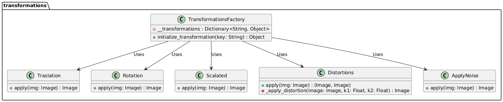

# Práctica 5: Detección de características mediante SIFT

Integrantes:
- Gerardo León Quintana
- Susana Suárez Mendoza

## Ejercicio. Desarrolle una aplicación que permita: 

### a. A través de la interfaz modificar los parámetros del detector de características SIFT. 

Para realizar la modificación de los parámetros del detector de características SIFT, se han creado `trackbars` en la interfaz de `OpenCV`. Estos controles permiten al usuario ajustar los parámetros de SIFT y el número de `matches` de acuerdo con sus necesidades. A continuación, se detallan los parámetros disponibles para el ajuste:
- `Features`: Especifica el número máximo de características (puntos clave) que SIFT intentará detectar en la imagen.
- `Layers`: Controla el número de capas por cada octava en la escala de SIFT. SIFT usa una pirámide de escalas (octavas) para detectar características a diferentes resoluciones.
- `Contrast`: Controla el umbral de contraste para la detección de características. Los puntos clave de bajo contraste se descartan.
- `Edge`: Filtra características sensibles a bordes fuertes, eliminando puntos clave ubicados en áreas con cambios rápidos en la intensidad (como los bordes).
- `Sigma`: Controla el valor de sigma en el suavizado gaussiano aplicado antes de construir la pirámide de escalas.
- `Matches`: Parámetro adicional que determina el número de coincidencias mostradas entre la imagen de referencia y la imagen en proceso. Este control permite al usuario limitar o expandir el número de coincidencias visibles para evaluar la precisión y relevancia de las coincidencias detectadas.

```python
cv.createTrackbar('Features', 'image', nfeatures, 800, nothing)
cv.createTrackbar('Layers', 'image', nOctaveLayers, 10, nothing)
cv.createTrackbar('Contrast', 'image', int(contrastThreshold*100), 100, nothing)
cv.createTrackbar('Edge', 'image', edgeThreshold, 100, nothing)
cv.createTrackbar('Sigma', 'image', int(sigma*10), 100, nothing)
cv.createTrackbar('Matches', 'image', 10, 100, nothing)
```

### b. Seleccionar un área de interés en una imagen de elección una imagen de naturaleza médica y una imagen telemétrica.

Por un lado, se seleccionará un área de interés en tres tipos de imágenes: una imagen de naturaleza médica, otra imagen telemétrica y otra personal. Las imágenes utilizadas forman parte de un subconjunto de datos extraído de los siguientes datasets de la plataforma Kaggle:

- **Imágenes telemétricas**: disponibles en el siguiente enlace: [Aerial Satellite Images Dataset](https://www.kaggle.com/datasets/ancaco12/aerial-satellite-images)
- **Imágenes médicas**: disponible en el siguiente enlace: [Brain tumors 256x256](https://www.kaggle.com/datasets/thomasdubail/brain-tumors-256x256).

Además de estas fuentes, se incorporan imágenes adicionales proporcionadas específicamente para este proyecto.
**Falta enlace médicas y las nuestras**

Por otro lado, para identificar y comparar un área específica en otras imágenes, el usuario selecciona manualmente un área de interés en una imagen. Este área, delimitada por un rectángulo, será usada como referencia para buscar coincidencias en el resto de imágenes del conjunto.
La selección se realiza mediante un recuadro que define las coordenadas de la esquina superior izquierda y la esquina inferior derecha. La siguiente función, `extract_interest_area`, utiliza estas coordenadas para extraer y guardar el área seleccionada. El área extraída se guarda en un archivo, facilitando su reutilización en procesos posteriores de detección.

```python
def extract_interest_area(start_point, end_point, img):
    x1, y1 = start_point
    x2, y2 = end_point
    # Verificación de la relación entre las coordenadas
    if x1 < x2 and y1 < y2:
        interest_area = img[y1:y2, x1:x2]
    else:
        interest_area = img[y2:y1, x2:x1]
    cv.imwrite('interest_area.png', interest_area)
```

### c. Generación de diferentes versiones de la imagen de partida.

Previo a la aplicación de SIFT, se generan distintas versiones de la imagen original mediante varias transformaciones. Esto da lugar a seis imágenes derivadas de la original en las que se buscará el área de interés. Las transformaciones aplicadas son las siguientes: traslación, rotación, escalado, distorsión de barril, distorsión de cojín y adición de ruido normal. Cada transformación se realiza mediante la selección aleatoria de sus parámetros, proporcionando variabilidad en las imágenes generadas.
Las clases encargadas de implementar estas transformaciones se presentan en la Figura 1, que contiene el diagrama de clases correspondiente.

<div align="center">
      
        <p><strong>Figura 1.</strong> Diagrama de clases para la aplicación de trasnformaciones. </p> 
</div>

### d. Buscar esa área de interés dentro de diferentes versiones de la imagen de partida.

Una vez generadas las diferentes versiones de la imagen original, se procede a aplicar el algoritmo de SIFT mediante la función `apply_sift` con los parámetros especificados por el usuario y luego, se muestran las coincidencias encontradas en nuevas ventanas de `OpenCV`.

**Modificar la parte del error cuando se tenga**

```python
def apply_sift(sift, img_orig, n=10):
    founded_matches = []

    # Transformaciones de la imagen
    img1, img2, img3, img4, img5, img6 = transform_img(img_orig)
    # Reducción del ruido mediante medianBlur
    img6 = reduce_noise(img6)
    
    interest_area = cv.imread('interest_area.png', cv.IMREAD_GRAYSCALE)
    keypoints1, descriptors1 = sift.detectAndCompute(interest_area, None)

    for img in [img1, img2, img3,  img4, img5, img6]:
        img = cv.cvtColor(img, cv.COLOR_BGR2GRAY)
        
        try:
            # 
            keypoints2, descriptors2 = sift.detectAndCompute(img, None)
            bf = cv.BFMatcher(cv.NORM_L2, crossCheck=True)
            matches = bf.match(descriptors1, descriptors2)

            # Ordenar las coincidencias por distancia y seleccionar las n mejores
            matches = sorted(matches, key=lambda x: x.distance)
            best_matches = matches[:n]

            img_matches = cv.drawMatches(interest_area, keypoints1, img, keypoints2, best_matches,
                                         None, flags=cv.DrawMatchesFlags_NOT_DRAW_SINGLE_POINTS)
            founded_matches.append(cv.cvtColor(img_matches, cv.COLOR_BGR2RGB))
        
        except:
            print("Error")
            founded_matches.append(img)
    
    return founded_matches
```

### e. A partir del detector de características “corrija” la imagen alterada para que se alinee con la imagen fuente. 

La homografía es una transformación proyectiva utilizada en visión por computadora para mapear puntos entre dos planos de imágenes, especialmente cuando las imágenes son de la misma escena pero vistas desde perspectivas diferentes. Al calcular una matriz de homografía, podemos transformar una imagen alterada por operaciones como rotación, escalado o traslación para alinearla con una imagen fuente, logrando que ambas parezcan capturadas desde la misma perspectiva.
Para llevar a cabo dicha corrección es necesario seguir los siguientes pasos:

1. **Detección de puntos clave**:
   Se detectan puntos clave (características) en ambas imágenes mediante un detector como SIFT. Estos puntos clave representan características significativas de las imágenes que son invariables ante cambios de traslacion, escala y rotación, lo que facilita la comparación entre ambas.

2. **Coincidencias de puntos**:
   Se identifican los puntos coincidentes entre ambas imágenes utilizando sus descriptores, lo que permite encontrar correspondencias entre las características detectadas.

3. **Cálculo de la homografía**:
   Con los puntos coincidentes, se calcula la matriz de homografía, una matriz de transformación que mapea los puntos de una imagen en coordenadas de otra.
   
4. **Aplicación de la homografía**:
   Finalmente, se utiliza la matriz de homografía para alinear la imagen alterada con la imagen fuente mediante una transformación de perspectiva, permitiendo corregir la orientación y posición de la imagen transformada para que coincida con la fuente.

Estos pasos se han desarrollado en la función `align_image` que se muestra a continuación.
```python
def align_image(img_orig, nfeatures, nOctaveLayers, contrastThreshold, edgeThreshold, sigma, n=10):

    img_orig = cv.cvtColor(img_orig, cv.COLOR_BGR2GRAY)
    sift = cv.SIFT_create(nfeatures=nfeatures, nOctaveLayers=nOctaveLayers, contrastThreshold=contrastThreshold,
                            edgeThreshold=edgeThreshold, sigma=sigma)

    img1, img2, img3, _, _, _ = transform_img(img_orig)
    transformed_img = random.choice([img1, img2, img3])
    if len(transformed_img.shape) == 3:
        transformed_img = cv.cvtColor(transformed_img, cv.COLOR_BGR2GRAY)

    # Paso 1:
    keyponits1, descriptors1 = sift.detectAndCompute(img_orig, None)
    keyponits2, descriptors2 = sift.detectAndCompute(transformed_img, None)

    bf = cv.BFMatcher(cv.NORM_L2, crossCheck=True)

    try:
        # Paso 2:
        matches = bf.match(descriptors1, descriptors2)
        matches = sorted(matches, key=lambda x: x.distance)
        best_matches = matches[:n]
        src_pts = np.float32([keyponits1[m.queryIdx].pt for m in best_matches]).reshape(-1, 1, 2)
        dst_pts = np.float32([keyponits2[m.trainIdx].pt for m in best_matches]).reshape(-1, 1, 2)

        # Paso 3:
        M, _ = cv.findHomography(dst_pts, src_pts, cv.RANSAC, 5.0)

        height, width = img_orig.shape[:2]
        size = (width, height)

        # Paso 4:
        aligned_img = cv.warpPerspective(transformed_img, M, size)

        aligned_img = cv.cvtColor(aligned_img, cv.COLOR_GRAY2BGR)
        transformed_img = cv.cvtColor(transformed_img, cv.COLOR_GRAY2BGR)

        return aligned_img, transformed_img
        
    except:
        return None, None
```

### d. Notificación de errores

## Aportaciones propias:

### 1. Manual 
### 2. Tumores ejemplo

Un usuario puede utilizar este programa para detectar tumores en diferentes imágenes.
